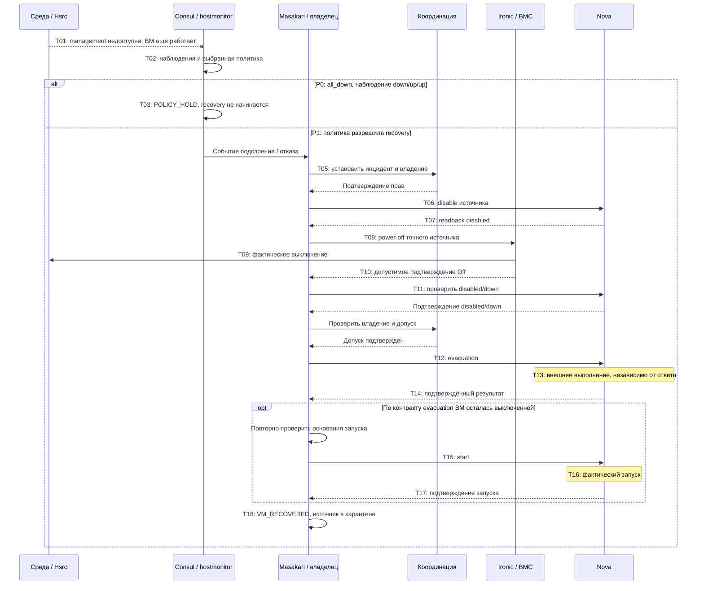

# SC-01: потеря management-связи у живого compute

Дата: 2026-10-01.\
Версия: 0.1.\
Основание: [паспорт HA-MODEL-0.1](HA_DRS_MODEL_V0_1.md).

## 1. Что исследуется

Исходный compute `Hsrc` теряет management-связь, но его ВМ `V` продолжает
работать. Наблюдения детектора могут привести либо к отсутствию recovery,
либо к fencing и восстановлению на `Hdst` — в зависимости от явно выбранной
политики. Назначение документа — сделать основания каждого перехода проверяемыми.

Таблицы задают исследовательскую спецификацию. Это не построчная реконструкция
TaskFlow: безопасная сверка после неопределённого результата, поля корреляции
и смена владельца являются обязательствами модели, а не заявлением об уже
реализованной автоматике. Обозначения F01–F09 и A01–A08 определены в паспорте.

## 2. Начальное состояние

| Объект | Значение |
|---|---|
| Источник | `Hsrc` включён; единственный экземпляр `v0` логической ВМ `V` фактически выполняется на нём |
| Назначение | `Hdst` доступен, совместим и имеет ёмкость |
| Данные ВМ | Доступны с `Hdst` по A03 |
| Сети | До инцидента наблюдения `manage/tenant/storage = up/up/up` |
| Nova | Источник `enabled/up`; `V` размещена на источнике; незавершённой migration нет |
| Владение | Активного инцидента и recovery-владельца ещё нет |
| Внешние запросы | Нет неразрешённых команд для `V` и её источника |
| Конкуренты | Watcher/Mistral/оператор не изменяют эти объекты по A06 |
| Аварийный путь `P1` | Предполагается включённый PowerOps и порядок задач F09; на стенде это пока не подтверждено |

Сам сетевой отказ изменяет связность, но не выключает источник и не меняет
`running[V]`. Вектор `down/up/up` — отдельно заданный результат наблюдения;
из физической потери management он не выводится автоматически без модели
топологии и детектора.

## 3. Два профиля одного физического отказа

| Профиль | Наблюдение | Условие политики | Ожидаемый исход |
|---|---|---|---|
| `P0-ALL-DOWN` | Свежие `down/up/up` | `all_down` по трём сетям | `POLICY_HOLD`: новых fencing/evacuation нет; ВМ продолжает работать |
| `P1-RECOVERY` | Те же свежие `down/up/up` | Исследовательская политика явно разрешает recovery | Достижим аварийный путь, если выполнены остальные предусловия |

Возвращение сети до любых внешних действий допускает завершение подозрения.
Возвращение сети после отправки fencing не отменяет уже принятую команду
и не разрешает автоматически включить источник в обслуживание.

## 4. Фазы процесса

| Фаза | Значение |
|---|---|
| `OBSERVING` | Нет незавершённого инцидента, ведётся наблюдение |
| `SUSPECTED` | Получены неблагополучные наблюдения |
| `POLICY_HOLD` | Наблюдений недостаточно для recovery по выбранной политике |
| `RECOVERY_ADMITTED` | Инцидент принят, исполнитель получил подтверждение владения; основания и корреляция сохранены |
| `DISABLE_PENDING` | Запрошен запрет нового размещения на источнике |
| `SOURCE_DISABLED` | Nova подтвердила административный запрет; ВМ ещё может работать |
| `FENCE_PENDING` | Power-off запрошен, его эффект пока не подтверждён |
| `SOURCE_ISOLATED` | Получено допустимое evidence остановки источника |
| `SOURCE_DOWN_CONFIRMED` | Дополнительно получено Nova `disabled/down` |
| `EVAC_PENDING` | Запрошена evacuation; её результат ещё устанавливается |
| `TARGET_PRESENT` | Перемещение подтверждено, ВМ на назначении выключена и требует start |
| `START_PENDING` | Запуск на назначении запрошен, эффект ещё не подтверждён |
| `VM_RECOVERED` | Контроллер объявил восстановление по наблюдениям; истинность объявления проверяется по I06 отдельно |

`BLOCKED(reason, phase)` накладывается на незавершённую фазу. Он не является
успешным концом сценария и не удаляет ожидающие внешние эффекты.

## 5. Таблица переходов: наблюдения и допуск

| ID | Событие и участник | Наблюдения | Предусловия | Действие | Подтверждение и новая фаза | При неопределённости |
|---|---|---|---|---|---|---|
| T01 | Среда разрывает management-связь | Контроллер ещё может видеть старое `up` | Начальное состояние | Среда меняет связность, сохраняя работающую `V` | Истина сценария изменилась; протокол пока `OBSERVING` | Не подменять задержку обнаружения немедленным `DOWN` |
| T02 | Детектор получает новые наблюдения | Вектор сетей и его свежесть | Есть соответствующее событие наблюдения | Сохранить наблюдения и вычислить подозрение | `SUSPECTED` | Старые/неполные данные помечаются как таковые |
| T03 | Политика отклоняет recovery | Для `P0`: `down/up/up` | `RecoveryPolicyAllows=false` либо нет достаточных данных | Продолжать наблюдение; не посылать изменяющих команд | `POLICY_HOLD` | Ожидать новых данных; не считать host физически выключенным |
| T04 | Связность восстановилась до изменяющих команд | Свежие благополучные наблюдения | Внешних команд этого инцидента ещё не было | Закрыть подозрение | `OBSERVING` | Если команда могла быть отправлена, использовать U01/U03, а не этот переход |
| T05 | Политика разрешает recovery, координатор допускает исполнителя | Вектор, identities, подтверждение владения и результаты сверки конфликтов | `P1` или иной явно разрешающий профиль; доступны основания корреляции и наблюдаемого допуска | Зафиксировать инцидент, подтверждение владения и планируемый объект действия | `RECOVERY_ADMITTED` | Потеря ответа координации означает `BLOCKED`; право владения не угадывается |

Принятие уведомления, запись в БД, RPC и приобретение владения не объявляются
одной атомарной транзакцией. T05 — укрупнённая фаза: перед исполняемой моделью
её нужно разбить на реальные точки фиксации и сбоя. Потеря ответа после любой
из них сохраняет возможный частичный результат.

## 6. Таблица переходов: disable и fencing

| ID | Событие и участник | Наблюдения | Предусловия | Действие | Подтверждение и новая фаза | При неопределённости |
|---|---|---|---|---|---|---|
| T06 | Исполнитель запрещает новое размещение на источнике | Актуальное сопоставление host и service | `RECOVERY_ADMITTED`; `ObservedOwnershipValid` | Сохранить намерение и запросить Nova disable | До readback: `DISABLE_PENDING` | Ответ API не означает изменения питания; повтор требует разбора прежнего запроса |
| T07 | Владелец читает Nova service | `status=disabled` правильного источника | Запрос T06 сопоставлен с инцидентом | Зафиксировать административный запрет | `SOURCE_DISABLED`; в том числе при `disabled/up` | `enabled` или неизвестный status не подтверждают disable; ни один из этих статусов сам по себе не доказывает выключение |
| T08 | Исполнитель инициирует fencing | Точная Ironic node, допустимые provision/network/target states | `SOURCE_DISABLED`, `ObservedOwnershipValid`, конфликтующие power-запросы разобраны | Сохранить намерение и запросить `power off` | До проверки результата: `FENCE_PENDING` | Тайм-аут не разрешает evacuation; переход U01 |
| T09 | Среда исполняет power-off | Контроллер может ещё не получить ответ | Ранее отправленный запрос может быть принят BMC | Фактически выключить `Hsrc`; убрать из `running[V]` все экземпляры на нём | Меняется мир, но не автоматически knowledge/phase | Этот эффект допустим и после timeout/restart; отсутствие ответа его не отменяет |
| T10 | Владелец получает подтверждение Off | Связанные с источником допустимые последовательные readback | Выполнен контракт evidence и не обнаружен конфликт; A04/A05 явно учитываются | Зафиксировать `stop_evidence` и карантин источника | `SOURCE_ISOLATED` | Устаревший, противоречивый или несопоставленный readback не разрешает переход |
| T11 | Владелец ожидает статус Nova после fencing | `status=disabled`, `state=down` | `SOURCE_ISOLATED`; evidence ещё действительно | Подтвердить готовность к рассмотрению evacuation | `SOURCE_DOWN_CONFIRMED` | `disabled/up` допускает ожидание; timeout/ошибка блокируют evacuation |

Основания F03–F05 поддерживают порядок и проверки исходников. A04/A05
сильнее одного наблюдения Off: их реализацию нужно исследовать отдельно.
Если источник уже выключен до T08, допустима ветка чтения T10 без новой
power-команды, но с теми же требованиями к identity и актуальности evidence.

## 7. Таблица переходов: evacuation и завершение

| ID | Событие и участник | Наблюдения | Предусловия | Действие | Подтверждение и новая фаза | При неопределённости |
|---|---|---|---|---|---|---|
| T12 | Владелец запрашивает evacuation | Источник, `V`, допустимое назначение, незавершённые операции | `SOURCE_DOWN_CONFIRMED` и все условия допуска из паспорта; выбранный механизм допуска разрешил операцию | Сохранить корреляцию и отправить один запрос evacuation | `EVAC_PENDING`; API acceptance не завершает фазу | Неизвестный результат переводит в U01; второй независимый запрос не отправляется |
| T13 | Среда исполняет принятую evacuation | Наблюдения могут отставать | Существует возможный принятый запрос | Создать/восстановить конкретный экземпляр `V` на `Hdst`; при соответствующем контракте Nova также включить его в `running[V]` | Меняется мир; исход определяется выбранным контрактом Nova | Эффект может завершиться после timeout и даже при `BLOCKED` |
| T14 | Владелец подтверждает результат evacuation | Терминальный результат операции, правильное назначение, ожидаемый vm/task state | Readback относится к текущей операции; evidence источника действительно | Зафиксировать завершение перемещения | Если ВМ выключена: `TARGET_PRESENT`; если работает: кандидат на T18 | Одной смены host или промежуточного `ACTIVE` недостаточно без выбранного контракта завершения |
| T15 | Исполнитель запрашивает отдельный start | Подтверждённая выключенная ВМ на `Hdst` | `TARGET_PRESENT`; актуальные основания изоляции, `ObservedOwnershipValid`, конфликтующие запросы разобраны | Сохранить намерение и отправить start | `START_PENDING` | Не повторять без разрешения исхода прежнего запроса |
| T16 | Среда исполняет start | Ответ контроллеру может отсутствовать | Существует возможный принятый запрос | Добавить соответствующий экземпляр на `Hdst` в фактическое `running[V]` | Меняется мир | Запоздалый эффект остаётся возможным после ошибки workflow |
| T17 | Владелец подтверждает отдельный start | Актуальное размещение и ожидаемое завершённое состояние | Результат сопоставлен с запросом T15 | Зафиксировать наблюдаемое завершение запуска | Кандидат на T18 | Нет подтверждения — U01/U02, а не объявление успеха |
| T18 | Владелец объявляет завершение recovery | Полный комплект согласованных подтверждений | Выполнены наблюдаемые основания объявления из раздела 8 паспорта; исходы потенциально конфликтующих запросов разрешены | Зафиксировать объявление восстановления, сохранить карантин источника | `VM_RECOVERED`; истину мира отдельно проверяет I06 | Нет подтверждений — блокировка; ложные подтверждения могут дать ложное завершение и нарушение I06 |

Переходы T09/T13/T16 принадлежат среде. Вариант модели с ошибочным контроллером
или утратившим актуальность разрешением не должен искусственно подавлять
опасный физический эффект: иначе I01 получится истинным по построению.
Инварианты оцениваются по результату переходов среды.

## 8. Неопределённость, повтор и смена владельца

| ID | Событие | Требуемое поведение исследовательской модели | Граница |
|---|---|---|---|
| U01 | Timeout, потеря ответа или crash после возможной отправки | Сохранить операцию и её возможные эффекты; установить `BLOCKED(unknown_outcome, phase)`; разрешить read-only сверку | Ошибка workflow не доказывает отмену запроса |
| U02 | Получено достоверное подтверждение судьбы прежней операции | Сопоставить operation/incident/identity, повторно проверить владение и evidence; продолжить от подтверждённой фазы | GET без результата сам по себе не доказывает, что запрос никогда не был принят |
| U03 | Повтор уведомления либо вернулась management-связь после отправки команды | Связать событие с текущим инцидентом; не создавать второй recovery и не отменять карантин | Корреляция повторов — проверяемое требование, её полнота в реализации ещё не доказана |
| U04 | Изменилось фактическое владение или исполнитель перезапустился | Разделить потерю полномочий и получение сведений о ней; при получении запретить новые команды; до него разрешить моделирование отправки со старым `owner_view`; сохранить все возможные эффекты | Строгое I02 может нарушиться; проверка lock перед API не закрывает окно check/send |
| U05 | Преемник получил полномочия и разобрал старые операции | Продолжать только с актуальным evidence и доказанным отсутствием неразрешённого конфликта | Если судьба старых эффектов не установлена, сохраняется `BLOCKED` |
| U06 | После Off обнаружены power-on, новый boot или иное опровержение evidence | Инвалидировать `stop_evidence`, запретить новые evacuation/start, учитывать фактическое исполнение | Уже запущенную вторую копию запрет нового действия не устраняет; возможное нарушение I01 должно быть показано |
| U07 | Evidence устарело либо выполнено его read-only обновление | При истечении свежести закрыть зависимые допуски; при допустимом обновлении заменить evidence, сохранив текущую фазу и операции | Не возвращаться в `SOURCE_ISOLATED` через T10 из `EVAC_PENDING` и не повторять evacuation; неизвестный исход запроса разрешается отдельно U02 |

Для U04 требуется моделировать отдельный шаг между проверкой ownership и
отправкой/выполнением запроса. Потеря владения не обновляет `owner_view`
мгновенно. Атомарная запись «проверил lock и выполнил BMC/Nova действие»
скрыла бы исследуемую гонку. Слово «владелец» в таблицах обозначает роль
исполнителя; истинность его полномочий не является скрытым guard среды.

## 9. Диаграмма последовательности

Диаграмма показывает основной путь. Операции чтения и записи не объединяются
в атомарные шаги при последующей формализации. Любой timeout/crash обрабатывается
по U01–U07; ветви ошибки не обозначают отмену внешнего эффекта.

## 10. Ожидаемые трассы для будущей проверки

Это задания проверяющему инструменту, а не результаты выполненного model checking.

| ID | Условия | Что требуется получить |
|---|---|---|
| C01 | `P0`, только `down/up/up` | T01 → T02 → T03; отсутствие fencing/evacuation; исходная ВМ работает |
| C02 | `P1`, допустимые подтверждения, зависимости доступны | Достижим T18 по основному пути; если evacuation запускает ВМ, T15–T17 отсутствуют |
| C03 | Power-off выполнен, ответ потерян | T09 произошёл, но T10 ещё нет; U01 блокирует T12 до достоверного разрешения исхода |
| C04 | Запрос fencing не дошёл до BMC | Источник и ВМ работают; timeout не должен разрешить T12 |
| C05 | Evacuation выполнена, ответ/подтверждение потеряны | U01 сохраняет возможное исполнение на `Hdst`; повтор T12 не создаётся вслепую |
| C06 | Потеря владельца между проверкой lock и внешним действием | Старый эффект остаётся достижимым; преемник не получает автоматически право на конфликтующую команду |
| C07 | Management восстановилась после отправки power-off | U03 сохраняет незавершённую операцию и карантин; поздний power-off остаётся возможным |
| C08 | Источник включается после подтверждения Off | При снятии A05/A06 достижимы инвалидирование evidence и потенциальное нарушение I01; не скрывать autostart предпосылками базовой модели |
| C09 | Start принят, но ответ потерян | Исследовать U01 для T15–T17; факт работающей ВМ и знание о нём могут различаться |
| C10 | Evidence истекло во время долгой evacuation | U07 блокирует зависимый допуск; read-only обновление сохраняет `EVAC_PENDING`; сверка результата не отправляет повторный POST |

Контрольные варианты с намеренно ослабленным условием допуска нужны для
проверки чувствительности модели: например, разрешить evacuation по одному
heartbeat timeout и найти трассу двойного исполнения. Успех поиска такого
контрпримера ещё не доказывает корректность полного протокола.

## 11. Что остаётся за пределами SC-01 v0.1

- SC-02: уже выполняющаяся DRS-миграция, включая различие её фаз.
- SC-03: плановая операция Mistral и аварийное recovery одного хоста.
- SC-04: массовый отказ, очередь, резерв ресурсов и пределы параллелизма.
- SC-05: проверка и возврат fenced-хоста в обслуживание.
- Прикладная доступность, RPO, потеря/повреждение storage и ошибки BMC evidence
  как самостоятельные модели отказа.

Последовательность следующей работы: выбрать конечные области переменных,
развернуть укрупнённые переходы на отправку/приём/effect/readback, затем
проверить I01–I06 и достижимость C01–C10 в пределах выбранных допущений.
