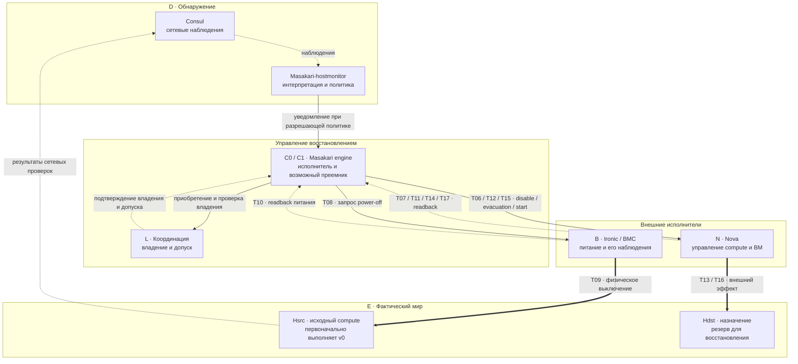
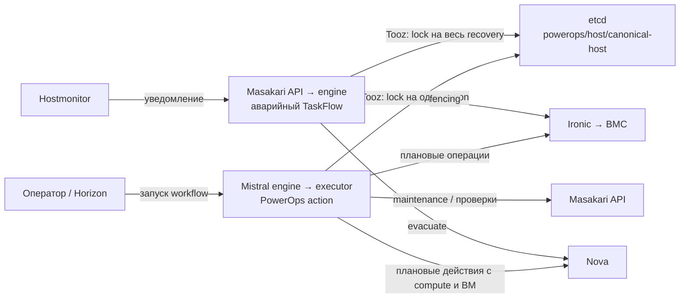
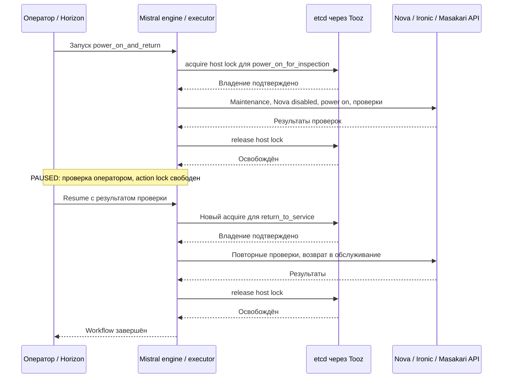
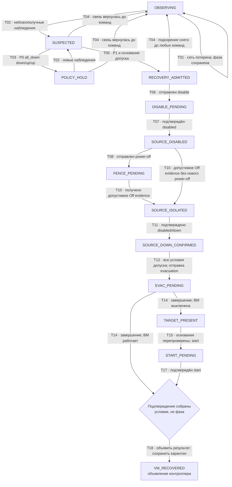
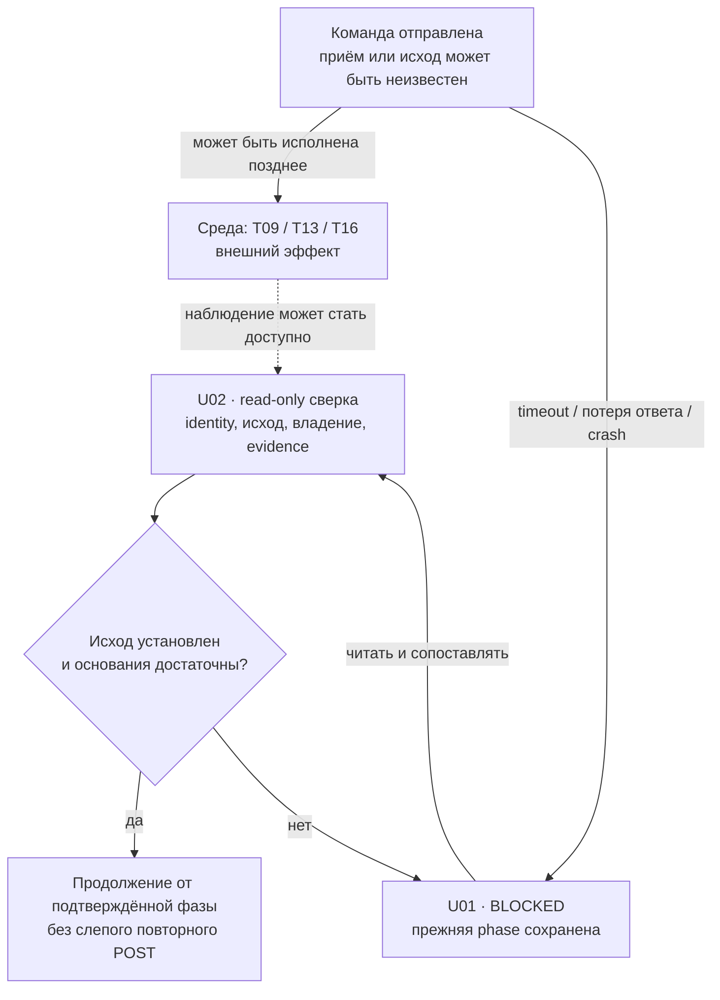

# Визуальная карта исследования HA/DRS

Дата: 2026-10-01. Версия: 0.3.

Схемы представляют [паспорт модели](HA_DRS_MODEL_V0_1.md) и
[переходы SC-01](HA_DRS_SCENARIO_01.md). Это представление исследовательской
спецификации, а не схема подтверждённого deployment или результат проверки
надёжности. Обозначения участников, T/U-переходов и I-свойств общие с этими
документами.

Выбранный состав исследования уточнён: [архивы + доработки mimaric](HA_DRS_IMPLEMENTATION_BASELINE.md).
HTML ниже пока воспроизводит архивный профиль; схемы Mistral в новом
разделе описывают его расширение по коду патчей, не состояние стенда.

## HTML-анимация SC-01

[HA_DRS_ANIMATION.html](HA_DRS_ANIMATION.html) — самостоятельный файл,
который можно открыть в браузере без сервера и сетевых зависимостей.
Он содержит три учебные трассы: C01/P0 (запрет recovery), C02/P1 (восстановление)
и C03/P1 (тайм-аут без допустимого подтверждения Off, завершение попытки ошибкой).

Управление: воспроизведение/пауза, шаг назад/вперёд, выбор кадра и скорость.
Анимированные сигналы различают запрос, подтверждение, физический эффект и
потерю сообщения. После события обновляется соответствующий слой состояния;
T09/T13 не обновляют знания контроллера автоматически. Для блокировок отдельно
показаны состояние etcd и последнее подтверждение для C0.

Направление межкомпонентного события обозначают стрелки на каждом участке
маршрута и подпись `отправитель → получатель`. Сплошная линия показывает
запрос, пунктирная — ответ или результат наблюдения. Локальное действие,
тайм-аут и ожидание интервала выделяются внутри компонента без движущегося
сообщения к нему самому. Состояние блоков относится к последнему завершённому
кадру; выполняющийся переход подписан отдельно. При пошаговом просмотре
сохраняется обозначение завершённого события. Повторные UUID-проверки
`K06/K08/K09` и polling `T10/T14` показаны укрупнённо: подпись уточняет,
что запросы и повторные чтения свёрнуты. Эта нотация не добавляет переходов
и не меняет семантику трасс.

Выбран профиль архивных исходников `masakari-pvs_1.0.1`, метод `auto`,
с предполагаемым включением PowerOps. В этом профиле исходно ACTIVE ВМ
восстанавливается evacuation до ACTIVE на другом хосте; отдельного start нет.
Это уточняет прежнюю учебную версию анимации с отдельным start. Общая модель
SC-01 по-прежнему допускает оба контракта Nova.

Длительности анимации условные. Трассы иллюстрируют спецификацию и исходники,
не являются результатом TLC или измерением стенда. Включение PowerOps и
соответствие этого профиля работающей конфигурации не проверены.
Исходный фрагмент: [ha-recovery-animation.html](visualizations/ha-recovery-animation.html).
При прямом открытии фрагмента без среды визуализации автоматически включаются
встроенные базовые стили и системные цвета браузера; кодировка UTF-8 задана явно.
В среде визуализации и полном экспорте используется их существующая тема.
Для передачи одного готового файла используйте `HA_DRS_ANIMATION.html`.

### Как раскрыта координация PowerOps

В анимации абстрактный участник `L` раскрыт как **PowerOpsCoordinator → Tooz
с драйвером etcd3gw → etcd**. PowerOpsCoordinator и Tooz работают внутри процесса
Masakari engine; etcd — внешний backend. Линии между библиотеками показывают
вызовы внутри процесса, а не отдельные сетевые сервисы.

| Механизм | Что показывает анимация | Основание в архиве M из паспорта |
|---|---|---|
| `powerops/host/Hsrc` | Блокировка исходного хоста на весь dispatch: disable, fencing, ожидания, восстановление ВМ; освобождение при выходе или ошибке | `taskflow/driver.py:181–205`; `powerops/coordination.py:169–197` |
| `powerops/evacuation/global` | Блокировка на одну ВМ, подтверждение результата и последующий `evacuation_interval`; затем release, для следующей ВМ — новое acquire | `taskflow/host_failure.py:405–427` |
| Heartbeat Tooz | Фоновая работа с момента `start(start_heart=True)` до остановки coordinator | `powerops/coordination.py:114–149` |
| `assert_healthy()` | Проверка живости heartbeat thread и UUID каждого удерживаемого lock через etcd txn и сверку key/value | `powerops/coordination.py:61–91,151–165` |
| Подтверждение evacuation | Новый host, ожидаемый исходный `vm_state`, `task_state=None`; для исходно ACTIVE отдельный start отсутствует | `taskflow/host_failure.py:262–403` |

Пути `taskflow/…` отсчитываются от `masakari/engine/drivers/`,
`powerops/…` — от `masakari/`. Имена блокировок в подписи — логические имена
Tooz, а не буквальное представление backend key. `Hsrc` — условное имя;
в код передаётся канонический Nova hostname. `notification_uuid` как member ID
coordinator и UUID конкретного lock — разные идентификаторы.

Кадры `K01–K15` раскрывают жизненный цикл координации между T-переходами
модели. Повторяющиеся UUID-проверки и Nova VM lock/reset/unlock укрупнены.
Когда удерживаются два locks, `assert_healthy()` проверяет оба. Успешный
UUID-check действителен на момент проверки; он не образует транзакцию с
Nova/Ironic и не отменяет уже отправленные запросы.

Идентификаторы T/U связывают события с исследовательской спецификацией;
это не утверждение о полном совпадении архивного кода с автоматом SC-01.
В частности, вместо T07 с отдельным readback перед fencing показан
`T06 · return`: disable-вызов завершился без ошибки и прошла пауза,
анимационная фаза — `DISABLE_RETURNED`. В архиве список сервисов читается
до disable; отдельной проверки `disabled/up` после вызова здесь нет
(`taskflow/host_failure.py:64–74`, `masakari/compute/nova.py:174–189`).
Подтверждение `disabled/down` выполняется после fencing. Это различие
с более сильным условием модели сохранено явно.

Global lock сериализует участвующие эвакуации в общем backend/namespace;
это **не reservation Hdst и не per-target guard**. Совместимость и свободный
резерв Hdst, а также отсутствие сторонних конфликтов, заданы A03/A06.
Отдельная ветка per-target admission и взаимодействие с Mistral/Watcher здесь
не включены. При исследовании масштаба нужно учитывать, что global lock занят
не только исполнением evacuation, но и интервалом после неё.
В методе `auto` запрос evacuation не задаёт target: `Hdst` — назначение,
выбранное Nova в данной трассе (`masakari/compute/nova.py:198–204`).

В C03 физическое выключение произошло, однако нужное стабильное Off evidence
до дедлайна не получено. Для выбранного `auto` flow завершается ошибкой;
в показанной трассе release host lock успешен, затем heartbeat останавливается.
Evacuation не отправлена, исход power-off для C0 остаётся неизвестным.
`BLOCKED` — обозначение состояния исследовательской модели, а не утверждение
о наличии одноимённой сохраняемой фазы в TaskFlow. Автоматическое U02
reconcile/resume в проверенном пути не реализовано. `auto_priority` и
`rh_priority` могут после ошибки запустить альтернативный полный flow под тем
же host lock; эта ветка не показана.

Освобождение locks не означает снятие карантина, отмену команды или разрешение
power-on. При неизвестном исходе нужна отдельная проверка перед продолжением
или возвратом источника. Анимация показывает успешное освобождение; отказ
backend при release и смена владельца остаются отдельными сценариями.

## 1. Карта компонентов аварийного пути

Карта отвечает на вопрос: кто наблюдает, принимает решение и исполняет
команду. `D` раскрыт на наблюдения Consul и политику hostmonitor. Остальные
подсистемы укрупнены до участников модели.



Обозначения связей:

- Сплошная стрелка — запрос, уведомление или управляющее действие.
- Пунктирная стрелка — наблюдение или подтверждение; доставка и свежесть
  не гарантируются самой стрелкой.
- Толстая стрелка — изменение фактического мира. Такой эффект может
  произойти позднее ответа или после тайм-аута.

`C0/C1` обозначают роли, а не число реплик deployment. `L` — абстракция;
для архивного PowerOps-профиля её детализация приведена в разделе анимации
выше. Другие профили требуют отдельного сопоставления. Подтверждение владения не является
транзакцией с Nova/Ironic и не отменяет уже отправленные действия.

PowerOps-ветка предполагается включённой для исследуемого профиля `P1`.
Наличие условной ветки в исходниках подтверждено F09, её включение на стенде
пока не подтверждено. В профиле `P0` при свежем `down/up/up` и `all_down`
recovery по этой строке матрицы не начинается. Полная семантика уведомлений
hostmonitor ещё требует проверки.

Базы данных, RPC, scheduler и внутренние процессы сервисов на этой карте
укрупнены. При расчёте готовности их нужно раскрыть, включая общие зависимости
и домены отказа; карту нельзя использовать как готовую схему независимых
последовательно соединённых элементов.

### Связанные контуры

| Контур | Отношение к модели | Где раскрывать |
|---|---|---|
| Watcher / DRS | Может изменять размещение тех же ВМ; в SC-01 конфликтующие действия исключены A06 | SC-02: уже начатая DRS-миграция |
| Mistral | Плановые операции могут затронуть те же хосты и ВМ; в SC-01 исключены A06 | SC-03: конкуренция плановой и аварийной операции |
| Kolla-Ansible | Задаёт конфигурацию и состав deployment | Карта конфигурации и привязка версии, отдельно от исполнения recovery |
| Возврат источника | Отдельная процедура с проверками; восстановление связи её не заменяет | SC-05: возврат fenced-хоста |

### Mistral: почему его работа не видна в текущей анимации

В HTML показан только аварийный путь Masakari. Mistral не вызывается между
fencing и evacuation: он исполняет отдельные плановые workflows и PowerOps
actions. Отсутствие его событий в этом сценарии ничего не говорит о состоянии
Mistral на стенде. В выбранном расширенном составе необходимо показать оба
пути и общий ресурс, за который они конкурируют:



PowerOps здесь — код внутри Masakari engine и Mistral executor. Tooz —
библиотека координации в каждом процессе. Отдельный сервер PowerOps не
появляется. Одинаковые backend, namespace и каноническое имя хоста —
предпосылки конкуренции за один lock. Уже отправленные внешние команды
потеря lock не отменяет.

Для `power_ops.power_on_and_return` граница action особенно важна:



Это успешная последовательность. Пауза не разрешает возврат автоматически:
следующий action получает lock заново и проверяет условия. Перед power-on
должны быть выполнены отдельные условия безопасного возврата источника;
эту схему нельзя автоматически пристыковать к финалу recovery как доказательство
отсутствия старых доменов. Read-only `host_power_status` lock не берёт.

Источники: [host coordination](https://github.com/lebtmalorny-rgb/mimaric/blob/71b0123f390bfeaab4dc4ca2dffaa6fab32a6cdf/horizon/patches/mistral/0001-feat-add-PowerOps-action-coordination.patch),
[границы action](https://github.com/lebtmalorny-rgb/mimaric/blob/71b0123f390bfeaab4dc4ca2dffaa6fab32a6cdf/horizon/patches/mistral/0006-fix-harden-planned-action-boundaries.patch),
[actions возврата](https://github.com/lebtmalorny-rgb/mimaric/blob/71b0123f390bfeaab4dc4ca2dffaa6fab32a6cdf/horizon/patches/mistral/0007-feat-add-guarded-host-return-actions.patch),
[workbook](https://github.com/lebtmalorny-rgb/mimaric/blob/71b0123f390bfeaab4dc4ca2dffaa6fab32a6cdf/horizon/patches/mistral/0008-feat-register-the-PowerOps-workbook-API.patch).
Это семантика поставляемой серии; совместимость серии `horizon` с имеющимися
архивами не установлена.

### Что переносить в следующий вариант анимации

| Сценарий | Что должно двигаться и меняться | Что нельзя подразумевать |
|---|---|---|
| Аварийное recovery с доработками | Masakari API устанавливает Watcher hold; engine держит host lock; Nova compute получает admission через durable claims | Mistral не является аварийным workflow engine; прежний global Tooz lock не действует одновременно с новым guard |
| Плановый PowerOps action | Mistral executor получает host lock и вызывает нужные API; отдельно видны запрос, ответ и локальная проверка | Весь workflow не держит один lock непрерывно |
| Конкуренция за Hsrc | Один владелец host lock; другой ждёт до допуска либо получает timeout/error | Watcher hold не является общей блокировкой Mistral и ручных Nova операций |
| Возврат хоста | `power_on_for_inspection` → release → PAUSED → новое acquire → `return_to_service` | PAUSED не означает зависший процесс или удерживаемую блокировку |
| Успешный финал recovery | Claims освобождаются при `COOLDOWN → DONE`; затем освобождён host lock, Watcher остаётся BLOCKED | Успех HA не вызывает автоматический resume Watcher; при UNKNOWN claims сохраняются |

Для расширенной анимации предлагается явно задавать исследовательский профиль
с включёнными PowerOps, Watcher guard и evacuation guard. Ответ пользователя
о составе исходников не устанавливает значения этих флагов в deployment.
Нужны отдельные показатели владельца host lock, Watcher hold и VM/target/slot
claims. Их объединение в один индикатор «координация» скрывает разные границы
защиты. Эти сценарии ещё не реализованы в текущем HTML.

## 2. Граф фаз SC-01

Граф показывает фазы знания и управления. T09/T13/T16 меняют фактический
мир и вынесены в следующий раздел. Ромб «Подтверждения собраны» — условие
перед объявлением результата, а не дополнительная фаза паспорта.



Ограничения чтения графа:

- `P1` — исследовательская политика, разрешающая recovery для указанного
  вектора. Она не выведена из поведения `all_down`.
- Для неизвестных или устаревших данных T03 также может оставить процесс
  без допуска. `UNKNOWN` не превращается в `DOWN`.
- T04 допустим только если ни одна изменяющая команда инцидента не могла
  быть отправлена. Для ветки после T05 ещё нужно детализировать закрытие
  принятого инцидента и освобождение владения; атомарность не предполагается.
- Ветви T14 используют наблюдаемый результат выбранного контракта Nova.
  Отдельный start требуется только для выключенной ВМ на назначении.
- `VM_RECOVERED` — сообщение контроллера. Его истинность проверяется по I06
  отдельно, по фактическим экземплярам ВМ. Ложное сообщение должно оставаться
  возможным в варианте с недостоверными наблюдениями.

Условие отправки T12 берётся из паспорта:

```text
ObservedOwnershipValid
AND RecoveryPolicyAllows
AND ValidStopEvidence(Hsrc)
AND ObservedNovaDisabledDown(Hsrc)
AND ReconciledConflictingOperations(V, Hsrc, Hdst)
AND TargetAdmitted
```

Оно вычисляется по доступным сведениям. Между проверкой владения и отправкой
запроса состояние координации может измениться; граф не даёт исполнителю
мгновенного знания об этом изменении.

## 3. Неопределённость и независимый внешний эффект

`BLOCKED(reason, phase)` сохраняет достигнутую фазу, историю операции и
возможные эффекты. Ниже показаны две независимые ветви после возможной
отправки запроса: выполнение во внешней системе и ожидание контроллера.



Относительный порядок `Effect` и `Blocked` не фиксирован. `BLOCKED` не
останавливает Ironic/Nova; отсутствие ответа не устанавливает факт исполнения
или неисполнения команды. Даже после физического эффекта наблюдения могут
оставаться недостаточными для продолжения.

Другие важные изменения состояния сохраняются в отдельных переходах:

| Переход | Что должно быть видно |
|---|---|
| U03 | Повтор события и возврат сети не создают новый recovery и не снимают карантин |
| U04 / U05 | Фактическое владение и `owner_view` могут расходиться; старые запросы сохраняются, преемник выясняет их исход |
| U06 | Новый boot или power-on опровергает stop evidence; уже произошедшее двойное исполнение не исчезает после запрета новых команд |
| U07 | Обновление evidence сохраняет текущую фазу, например `EVAC_PENDING`, и не повторяет evacuation |

## 4. Как связывать следующие визуализации с моделью

На текущем этапе источники определений — паспорт и таблицы SC-01. Схемы
Mermaid и учебные последовательности событий подготовлены вручную.
HTML-анимация формирует кадры по этим последовательностям. Общего исполняемого
описания протокола и генерации трасс формальным проверяющим инструментом ещё нет.

Для следующего этапа предлагается общий формат трассы:

| Поле | Назначение |
|---|---|
| `model_version`, `scenario_id`, `profile`, `assumptions` | Позволяют понять границы интерпретации |
| `trace_origin` | Различает иллюстрацию, model checker, дискретно-событийную симуляцию и стенд |
| `step_id`, `transition_id`, `actor_id` | Связывают кадр с участником и T/U-переходом |
| `logical_order`, необязательный `time` с единицей | Отделяют порядок событий от измеренных или моделируемых длительностей |
| `incident_id`, `operation_id`, сведения о владельце | Связывают повтор, запрос, ответ и смену исполнителя; отсутствие данных фиксируется явно |
| `world`, `observations`, `protocol` до и после события | Разделяют факты мира, знания участников и фазу процесса |
| `guards`, `property_results` | Показывают основания допуска и результат проверки конкретного свойства |

Это эскиз контракта, не утверждённая JSON Schema. У стендового журнала обычно
нет полного доступа к фактическому миру: неизвестные поля остаются неизвестными.
Поле Nova `host` не подставляется вместо фактического множества экземпляров.

Следующая реализация должна строить граф фаз и проигрывание трассы из общих
идентификаторов. До её появления изменения схем проверяются по таблицам
SC-01. Первый полезный набор трасс: C01 (политика запрещает recovery), C02
(восстановление достижимо), C03 (потерян ответ fencing), C06 (смена владельца).

## 5. Представление масштаба и количественных результатов

Для 1000+ хостов обзор раскрывается по уровням:

```text
Кластер → cell / домен отказа → стойка → хост → инцидент → трасса ВМ
```

Реальные отношения между cells, стойками и доменами отказа задаются топологией;
эта последовательность — навигация, а не утверждение о строгом вложении.

После появления результатов моделирования к обзору добавляются:

- размер очереди и число одновременно выполняемых восстановлений во времени;
- доступная ёмкость в затронутых и резервных доменах;
- распределение времени восстановления и доля восстановлений до дедлайна;
- вероятностная готовность выбранной подсистемы и чувствительность к параметрам.

Незавершённые восстановления учитываются явно. Числа, доверительные интервалы
и вероятности появятся только вместе с входными данными, допущениями и методом
расчёта; в текущих схемах таких результатов нет.
