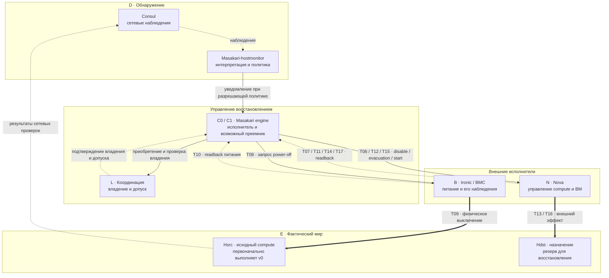
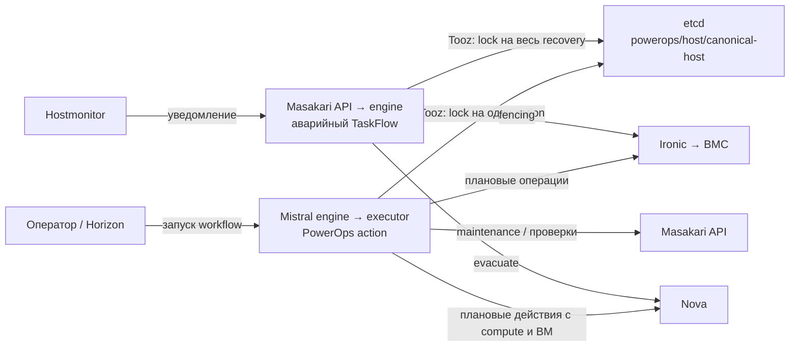
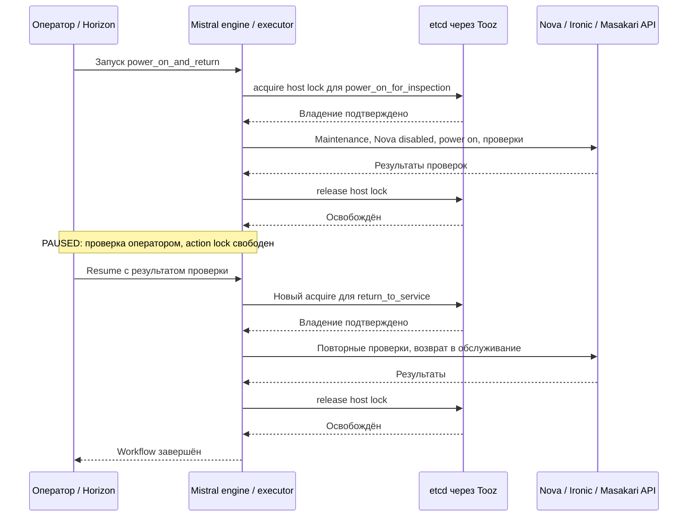
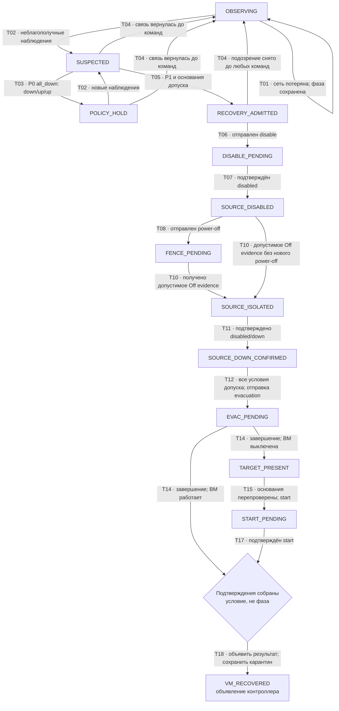
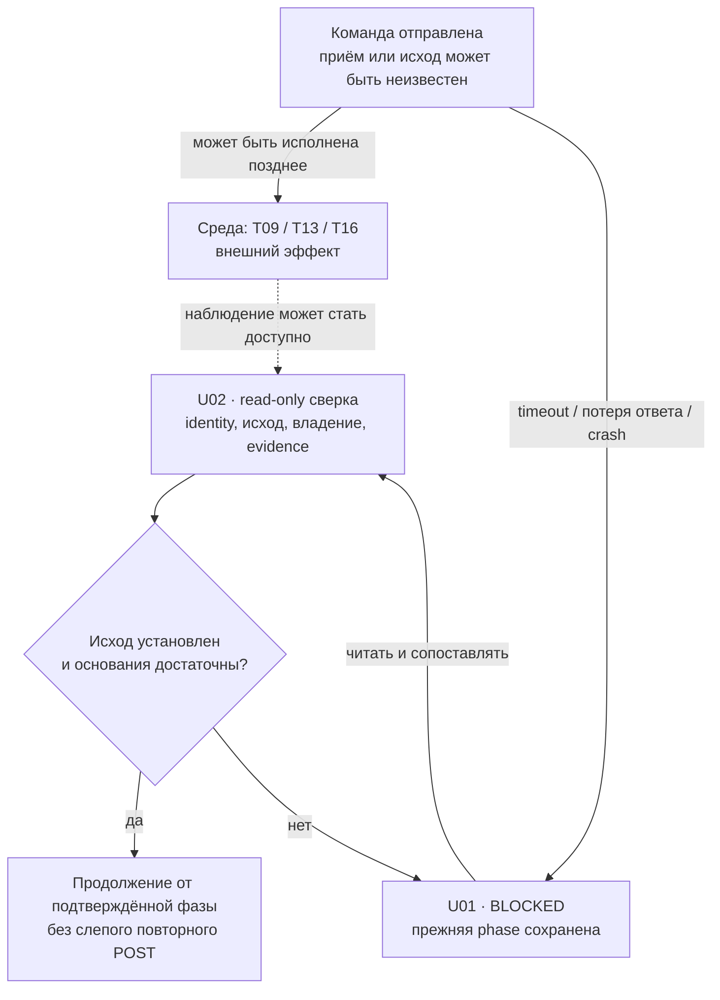

# Визуальная карта исследования HA/DRS

Дата: 2026-10-01. Версия: 0.6.

Карта объединяет два уровня описания: исходный [паспорт модели v0.1](HA_DRS_MODEL_V0_1.md)
с [переходами SC-01](HA_DRS_SCENARIO_01.md) и отдельные иллюстративные трассы
[композиционного исследовательского профиля](HA_DRS_IMPLEMENTATION_BASELINE.md).
Переходы T/U и свойства I относятся к исходной модели. Новые идентификаторы
событий HTML самостоятельны и не расширяют спецификацию SC-01 v0.1.
Ни один из этих уровней не является схемой подтверждённого deployment или
результатом проверки надёжности.

## HTML-анимация композиционного профиля

[HA_DRS_ANIMATION.html](HA_DRS_ANIMATION.html) — самостоятельный файл,
который можно открыть в браузере без сервера и сетевых зависимостей.
Профиль по умолчанию — **архивы + `mimaric` из ветки
`feature/masakari-per-target-evacuation`, commit `71b0123`**. Для иллюстрации
предполагаются включённые PowerOps, Watcher automation hold guard и receiving-compute
evacuation guard, метод recovery `auto` и политика `all_down` для трёх
эффективных сетей `manage/tenant/storage`. Это выбранные условия иллюстрации;
совместное дерево исходников, включение флагов и поведение стенда не подтверждены.
Namespaces предполагаются подготовленными. Начальный Watcher `READY` означает
ранее выполненный оператором resume; initialize создаёт `BLOCKED`. Обозначения
`E0/E1` в анимации — условные UUID epoch. Новый incident меняет epoch,
идемпотентный повтор того же incident его сохраняет.

| Ключ сценария | Начальные условия и показанный исход |
|---|---|
| `normal` | Живой источник изолирован по трём выбранным сетям: `down/down/down`; `all_down` разрешает recovery. После fencing и durable admission ВМ восстановлена, claims и host lock освобождены; Watcher остаётся `BLOCKED` |
| `lost` | Допуск recovery есть, но допустимое стабильное Off evidence не получено до fencing deadline. Попытка завершается ошибкой и освобождает host lock; evacuation не отправлена |
| `hold` | Свежий вектор `down/up/up` не удовлетворяет `all_down`; recovery не начинается, исходная ВМ продолжает работать |
| `planned` | Mistral выполняет `planned_power_off` на пустом хосте с `require_empty`; PowerOps action получает собственный host lock, выполняет проверки и power-off, затем освобождает lock |
| `contention` | Masakari владеет host lock, пока Mistral пытается начать плановый action на том же хосте. Ожидание Mistral заканчивается timeout/`ERROR`; Mistral не отправляет power-команду |
| `return` | Отдельный пустой источник в maintenance, с пустым manifest и предполагаемыми выполненными операторскими условиями. `power_on_for_inspection` освобождает свой lock; workflow останавливается в `PAUSED` до явного модельного resume, затем `return_to_service` получает новый lock и повторяет проверки |
| `unknown` | Потерянный ответ даёт `intent.observation=UNKNOWN`, пока receiving operation остаётся `RUNNING`. Позднейшая ошибка completion proof переводит operation в `UNKNOWN`; claims сохраняются, автоматического retry нет |

`normal` использует `down/down/down`, а исходный SC-01 v0.1 исследует
`down/up/up` с отдельной условной политикой `P1`. Эти условия не взаимозаменяемы.
В `lost` физический power-off может состояться без достаточного знания Masakari;
отсутствие evidence запрещает evacuation. Освобождение host lock не отменяет
уже отправленную команду и не разрешает включение источника.

Управление: воспроизведение/пауза, шаг назад/вперёд, выбор сценария, кадра и скорости.
В сценарии `return` автоматическое проигрывание останавливается на `PAUSED`;
продолжение требует отдельной кнопки модельного подтверждения оператора.
Она продолжает иллюстрацию, а не отправляет команду в Mistral или кластер.
Возврат хоста показан отдельно от аварийного recovery и не запускается его успехом.

Направление межкомпонентного события обозначают стрелки на каждом участке
маршрута и подпись `отправитель → получатель`. Запросы и ответы различаются;
физический эффект, потеря ответа и локальная проверка отмечены отдельно.
Локальное действие, timeout, ожидание cooldown и operator pause выделяются
внутри компонента без движущегося сообщения к нему самому. Состояние блоков
относится к последнему завершённому кадру; выполняющийся переход подписан отдельно.

Схема разделена на три визуальные группы: **HA / PowerOps · управление**
(hostmonitor, свёрнутые Consul-кластеры и локальные endpoints наблюдателя,
Masakari API и engine, Mistral, Watcher, Ironic, etcd и оператор/Horizon),
**Nova · управление** (API, conductor и scheduler) и **Compute-хосты · агенты и ВМ**
(отдельные Hsrc/Hdst с Consul agents, nova-compute и libvirt/QEMU; BMC показан
отдельно от ОС хоста). Первая группа обозначает логический контур взаимодействия,
а не единый процесс или место развёртывания. PowerOps остаётся библиотекой
внутри Masakari engine и Mistral executor; etcd — общим хранилищем координации.
Nova-compute остаётся сервисом Nova, но расположен в группе соответствующего
хоста, чтобы было видно, где исполняется задача и находится экземпляр ВМ.

Размещение hostmonitor следует архивному Kolla-Ansible: в
`kolla-ansible-pvs/ansible/inventory/multinode` группа `masakari-hostmonitor`
наследует `control`; `ironic-api` и `ironic-conductor` наследуют `ironic`,
а та — `control`. `ansible/site.yml` добавляет compute и узлы hostmonitor в
`consul-client`. Локальный Consul обязателен на узле hostmonitor
(`ansible/roles/masakari/tasks/precheck.yml`), а шаблон
`ansible/roles/masakari/templates/masakari-monitors.conf.j2` по умолчанию
задаёт loopback endpoints для наблюдаемых сетей. Hostmonitor
на control получает наблюдение недоступности Hsrc и отправляет уведомление
Masakari; выключенный Hsrc не сообщает о собственном отказе. Consul agents
на compute показаны отдельно от server-групп: `site.yml` назначает servers
по сетям `api → control`, `tunnel → network`, `storage → storage`. BMC остаётся
отдельным контроллером питания, доступность которого не следует из состояния
ОС хоста. Это отображение архивного состава и условий трассы, а не проверка
фактического inventory или доступности сервисов стенда.

Команда питания раскрыта как `Ironic API → conductor → BMC Hsrc`.
Пересылка команды ещё не меняет питание: физический эффект BMC показан
следующим кадром. Чтение через Ironic обратно к PowerOps остаётся свёрнутым.
BMC Hdst показан как структурный участник; в выбранных трассах команд
изменения его питания нет.

### Постоянные связи и положение etcd

Etcd расположен в центре координации. Тонкие серые линии постоянно показывают
связи участников выбранных сценариев; это **не текущий трафик, не проверка
доступности и не признак удержания lock**. Активный запрос или ответ выделяется
поверх них цветом и направленной стрелкой. Линии включают также наблюдения
и физические эффекты, поэтому не все связи являются API-вызовами.
Группы различаются мягкой цветовой заливкой и рамками. Внешние маршруты
отнесены от рамок, а активная стрелка имеет контрастную подложку;
цвет группы не обозначает её состояние или доступность.

С etcd связаны пять клиентов: Masakari API, Masakari engine, Mistral,
Watcher и принимающий nova-compute Hdst. Masakari API устанавливает Watcher hold;
engine работает с host lock, hold и evacuation intent/proof; Mistral использует
host lock; Watcher проверяет допуск автоматизации; принимающий compute выполняет
evacuation admission и сохраняет результат. Nova API, conductor, scheduler,
libvirt/QEMU и BMC не показаны клиентами этих механизмов etcd. Команды Nova
и Ironic имеют собственные связи и не проходят через центральный блок.

### Nova: управление, сервис хоста и фактическая ВМ

В HTML отдельно показаны Nova API, nova-conductor и nova-scheduler.
Для Hsrc и Hdst различаются nova-compute и libvirt/QEMU: compute исполняет
задачи Nova, а блок libvirt/QEMU показывает физическое состояние домена
в модели вместе с питанием соответствующего хоста. На Hdst guard находится
в процессе nova-compute, до локального rebuild через драйвер libvirt.
Название контейнера `nova_libvirt` не означает ещё один Nova API.

`enabled/disabled` и `up/down` относятся к **nova-compute конкретного хоста**.
`ACTIVE` относится к **ВМ V**. Эти значения больше не объединяются в карточке
Nova API. Для Hdst `enabled/up` — явно заданное начальное условие иллюстрации,
а не результат дополнительной проверки стенда. Для Hsrc результат команды
`disable: вызов завершён` не заменяет последующее чтение `disabled/down`.

Местоположение и статус ВМ по Nova подписаны как последнее наблюдение.
До нового readback наблюдатель может по-прежнему знать `Hsrc · ACTIVE`,
хотя в фактическом мире Hsrc уже выключен, а затем v1 запущен на Hdst.
Отсутствие heartbeat nova-compute само по себе также не означает остановку
libvirt или ВМ. Физический эффект и обновление знания показаны разными кадрами.

Блоки компонентов сделаны компактнее при сохранении размера текста. Внутри
каждого libvirt/QEMU отдельно выделена ВМ V: заполненный маркер означает
работающий экземпляр, квадрат — остановленный, пунктирная пустая плашка —
отсутствие ВМ на хосте. v0/v1 — экземпляры одной логической ВМ, не две разные ВМ.
Строка над схемой показывает место выполнения в **фактическом мире модели**;
последнее чтение Nova приведено отдельно. Между fencing и rebuild работающего
экземпляра нет. В `unknown` ВМ может уже работать на Hdst, хотя Nova readback
наблюдателя остаётся старым, а результат recovery не подтверждён. Маркеры
обновляются после завершения кадра; перемещение сетевого сообщения не означает
миграцию ВМ между хостами.

Для автоматического выбора назначения раскрыт путь:

1. Nova API отправляет асинхронный `rebuild_instance(recreate=true)` в conductor
   **до** ответа о принятии POST. Ответ не подтверждает исполнение rebuild.
2. Conductor вызывает `scheduler.select_destinations`; scheduler возвращает
   выбранные host/node обратно conductor.
3. Conductor отправляет compute RPC принимающему nova-compute Hdst.
4. Receiving guard регистрирует `WAITING` и получает admission `RUNNING` в etcd.
   Только после допуска исполняется локальный rebuild через libvirt/QEMU Hdst.

Placement, БД, RabbitMQ и служебные вызовы Nova свёрнуты. Путь показан по
архитектурному справочнику upstream Nova `stable/2025.1`:
[API evacuate](https://github.com/openstack/nova/blob/stable/2025.1/nova/compute/api.py#L5236-L5304),
[conductor RPC cast](https://github.com/openstack/nova/blob/stable/2025.1/nova/conductor/rpcapi.py),
[выбор назначения и dispatch conductor](https://github.com/openstack/nova/blob/stable/2025.1/nova/conductor/manager.py#L1237-L1327),
[libvirt spawn](https://github.com/openstack/nova/blob/stable/2025.1/nova/virt/libvirt/driver.py#L4452-L4513).
Эти ссылки подтверждают распределение обязанностей upstream. Полного дерева
Nova форка среди предоставленных архивов нет; совместимость с ним receiving
guard и фактическая конфигурация libvirt ещё не проверены. Локальный
[патч receiving guard](https://github.com/lebtmalorny-rgb/mimaric/blob/71b0123f390bfeaab4dc4ca2dffaa6fab32a6cdf/hotfixes/masakari-per-target-evacuation/nova/0001-Guard-receiving-compute-evacuation-with-durable-per-.patch)
задаёт обёртку `ComputeManager.rebuild_instance` и сохраняет выбранное Nova
назначение; он не заменяет scheduler или Placement.

### Три независимых механизма координации

В схеме PowerOps и Tooz находятся **внутри Masakari engine и Mistral executor**;
это библиотеки процесса. Guard работает внутри Masakari/Nova. Etcd показан
внешним backend. Внутрипроцессный вызов не изображает отдельный сетевой сервис.

| Индикатор | Что показывает анимация | Граница механизма |
|---|---|---|
| Host lock | Владелец `powerops/host/<canonical Nova hostname>`, acquire/check/release через PowerOps → Tooz → etcd | У Masakari — весь recovery; у Mistral — один composite action. Между actions workflow lock свободен |
| Evacuation admission | Durable intent, состояние operation и VM/target/global-slot claims в etcd | Прямой guard API без Tooz и без lease/TTL claims; admission разрешает rebuild на принимающем compute |
| Watcher hold | Persistent automation gate и его `BLOCKED` после инцидента | Ограничивает новый автоматический допуск Watcher; не блокирует Mistral и не отменяет уже допущенное действие |

Источники и точные границы механизмов приведены в
[разделах 3–4 состава реализации](HA_DRS_IMPLEMENTATION_BASELINE.md#3-три-механизма-координации).
UUID host lock отличается от notification UUID и Mistral action execution ID.
Heartbeat Tooz и проверка UUID владения также различаются. Успешная проверка
не образует транзакцию с Nova/Ironic и не отменяет ранее отправленный запрос.

В успешной трассе `normal` показан следующий порядок:

1. Masakari API сохраняет Watcher hold **до** создания notification и RPC;
   engine повторяет установку hold идемпотентно.
2. Masakari получает host lock, выполняет disable, fencing и получает Off evidence,
   затем подтверждение Nova `disabled/down`.
3. До `POST evacuate` сохраняются durable intent `SUBMITTING`, request ID и VM claim.
   Nova API отправляет задачу conductor до ответа на POST. Conductor получает
   назначение от scheduler и передаёт rebuild выбранному nova-compute;
   target не задаётся Masakari в `auto`.
4. Guard принимающего nova-compute регистрирует `WAITING`; etcd CAS атомарно
   проверяет VM claim, доступность target по ComputeNode UUID и global slot.
   Только admission `RUNNING` разрешает локальный rebuild.
5. После rebuild проверяется completion proof. `COOLDOWN` в иллюстрации длится
   5 секунд, удерживая VM/target/slot claims, даже если ВМ уже `ACTIVE`.
6. `DONE` атомарно освобождает claims. Masakari сопоставляет Nova readback со связанным
   operation/proof и выполняет финальную проверку Nova, затем освобождает host lock. Watcher остаётся `BLOCKED` до отдельной
   процедуры resume, отсутствующей в успешном HA-финале.

Предыдущий архивный путь с `powerops/evacuation/global` в этой анимации не
используется. В архиве M он сериализует evacuation и последующий интервал;
это историческое сравнение, а не дополнительная блокировка вокруг нового guard.
Архивные факты F06 и соответствующие ссылки сохранены в паспорте и составе реализации.

`intent.observation=UNKNOWN` описывает знания отправителя, а
`operation.state=UNKNOWN` — состояние операции guard. Первое не переводит
автоматически второе: receiving compute может продолжать работу. В `unknown`
обе точки показаны раздельно; после ошибки proof claims остаются занятыми.
Истечение времени не разрешает повторный rebuild или освобождение claims.
После ошибки POST Masakari отмечает попытку неуспешной и выполняет cleanup,
не начиная ожидание успешного результата. В выбранной трассе host lock уже
освобождён, когда принимающий compute заканчивает свою независимую работу.

Длительности и входные условия учебные. Проверки
`node --test tests/animation-traces.test.cjs` предназначены для временных свойств
самих трасс: порядка допуска, удержания claims, паузы и отсутствия запрещённых
команд. Они не являются model checking, проверкой production-кода или результатом
стендового прогона. Исполняемая формальная модель ещё не построена.

Исходный фрагмент: [ha-recovery-animation.html](visualizations/ha-recovery-animation.html).
При прямом открытии фрагмента без среды визуализации автоматически включаются
встроенные базовые стили и системные цвета браузера; кодировка UTF-8 задана явно.
Для передачи одного готового файла используйте `HA_DRS_ANIMATION.html`.

## 1. Карта компонентов аварийного пути

Карта отвечает на вопрос: кто наблюдает, принимает решение и исполняет
команду. `D` раскрыт на наблюдения Consul и политику hostmonitor. Остальные
подсистемы укрупнены до участников модели.



Обозначения связей:

- Сплошная стрелка — запрос, уведомление или управляющее действие.
- Пунктирная стрелка — наблюдение или подтверждение; доставка и свежесть
  не гарантируются самой стрелкой.
- Толстая стрелка — изменение фактического мира. Такой эффект может
  произойти позднее ответа или после тайм-аута.

Эта карта сохраняет границы исходного SC-01 v0.1. `C0/C1` обозначают роли,
а не число реплик deployment. `L` — абстракция; детализация координации
композиционного HTML-профиля приведена выше и требует отдельного сопоставления
с переходами модели. Подтверждение владения не является транзакцией с Nova/Ironic
и не отменяет уже отправленные действия.

PowerOps-ветка предполагается включённой для исследуемого профиля `P1`.
Наличие условной ветки в исходниках подтверждено F09, её включение на стенде
пока не подтверждено. В профиле `P0` при свежем `down/up/up` и `all_down`
recovery по этой строке матрицы не начинается. Полная семантика уведомлений
hostmonitor ещё требует проверки.

Базы данных, RPC, scheduler и внутренние процессы сервисов на этой карте
укрупнены. При расчёте готовности их нужно раскрыть, включая общие зависимости
и домены отказа; карту нельзя использовать как готовую схему независимых
последовательно соединённых элементов.

### Связанные контуры

| Контур | Отношение к модели | Где раскрывать |
|---|---|---|
| Watcher / DRS | Может изменять размещение тех же ВМ; в SC-01 конфликтующие действия исключены A06 | SC-02: уже начатая DRS-миграция |
| Mistral | Плановые операции могут затронуть те же хосты и ВМ; в SC-01 исключены A06 | SC-03: конкуренция плановой и аварийной операции |
| Kolla-Ansible | Задаёт конфигурацию и состав deployment | Карта конфигурации и привязка версии, отдельно от исполнения recovery |
| Возврат источника | Отдельная процедура с проверками; восстановление связи её не заменяет | SC-05: возврат fenced-хоста |

### Mistral: плановые actions, конкуренция и возврат

В HTML работа Mistral показана в отдельных сценариях `planned`, `contention`
и `return`. Mistral исполняет плановые workflows и PowerOps actions;
аварийным recovery управляет Masakari. Оба пути используют общий host lock:



PowerOps здесь — код внутри Masakari engine и Mistral executor. Tooz —
библиотека координации в каждом процессе. Отдельный сервер PowerOps не
появляется. Одинаковые backend, namespace и каноническое имя хоста —
предпосылки конкуренции за один lock. Уже отправленные внешние команды
потеря lock не отменяет.

Для `power_ops.power_on_and_return` граница action особенно важна:



Это успешная последовательность сценария `return` для отдельного пустого
источника: maintenance уже включён, manifest пуст, операторские условия
безопасного power-on предполагаются выполненными. После `power_on_for_inspection`
lock освобождён. На `PAUSED` автоматическое проигрывание останавливается;
явное модельное подтверждение оператора позволяет перейти к новому action.
`return_to_service` заново получает lock и повторяет проверки. Этот сценарий
не продолжает автоматически финал HA и не доказывает отсутствие старых доменов
на реальном хосте. Read-only `host_power_status` lock не берёт.

Источники: [host coordination](https://github.com/lebtmalorny-rgb/mimaric/blob/71b0123f390bfeaab4dc4ca2dffaa6fab32a6cdf/horizon/patches/mistral/0001-feat-add-PowerOps-action-coordination.patch),
[границы action](https://github.com/lebtmalorny-rgb/mimaric/blob/71b0123f390bfeaab4dc4ca2dffaa6fab32a6cdf/horizon/patches/mistral/0006-fix-harden-planned-action-boundaries.patch),
[actions возврата](https://github.com/lebtmalorny-rgb/mimaric/blob/71b0123f390bfeaab4dc4ca2dffaa6fab32a6cdf/horizon/patches/mistral/0007-feat-add-guarded-host-return-actions.patch),
[workbook](https://github.com/lebtmalorny-rgb/mimaric/blob/71b0123f390bfeaab4dc4ca2dffaa6fab32a6cdf/horizon/patches/mistral/0008-feat-register-the-PowerOps-workbook-API.patch).
Это семантика поставляемой серии; совместимость серии `horizon` с имеющимися
архивами не установлена.

### Что показывают плановые сценарии

| Сценарий | Граница action и результат |
|---|---|
| `planned` | `planned_power_off` с `require_empty` проверяет пустой хост под собственным host lock; только после проверок отправляет power-off, подтверждает результат и освобождает lock |
| `contention` | Masakari остаётся владельцем lock; Mistral ждёт, получает timeout/`ERROR` и не отправляет power-команду. Watcher hold не участвует в этом отказе допуска |
| `return` | `power_on_for_inspection` → release → `PAUSED` → явный модельный resume → новый acquire → повторные проверки → `return_to_service` → release |

Три показателя — владелец host lock, Watcher hold и VM/target/slot claims —
отображаются раздельно. Успех Mistral action не означает автоматического resume
Watcher; успешный HA-финал также сохраняет Watcher `BLOCKED`.

## 2. Граф фаз SC-01

Граф показывает фазы знания и управления. T09/T13/T16 меняют фактический
мир и вынесены в следующий раздел. Ромб «Подтверждения собраны» — условие
перед объявлением результата, а не дополнительная фаза паспорта.



Ограничения чтения графа:

- `P1` — исследовательская политика, разрешающая recovery для указанного
  вектора. Она не выведена из поведения `all_down`.
- Для неизвестных или устаревших данных T03 также может оставить процесс
  без допуска. `UNKNOWN` не превращается в `DOWN`.
- T04 допустим только если ни одна изменяющая команда инцидента не могла
  быть отправлена. Для ветки после T05 ещё нужно детализировать закрытие
  принятого инцидента и освобождение владения; атомарность не предполагается.
- Ветви T14 используют наблюдаемый результат выбранного контракта Nova.
  Отдельный start требуется только для выключенной ВМ на назначении.
- `VM_RECOVERED` — сообщение контроллера. Его истинность проверяется по I06
  отдельно, по фактическим экземплярам ВМ. Ложное сообщение должно оставаться
  возможным в варианте с недостоверными наблюдениями.

Условие отправки T12 берётся из паспорта:

```text
ObservedOwnershipValid
AND RecoveryPolicyAllows
AND ValidStopEvidence(Hsrc)
AND ObservedNovaDisabledDown(Hsrc)
AND ReconciledConflictingOperations(V, Hsrc, Hdst)
AND TargetAdmitted
```

Оно вычисляется по доступным сведениям. Между проверкой владения и отправкой
запроса состояние координации может измениться; граф не даёт исполнителю
мгновенного знания об этом изменении.

## 3. Неопределённость и независимый внешний эффект

`BLOCKED(reason, phase)` сохраняет достигнутую фазу, историю операции и
возможные эффекты. Ниже показаны две независимые ветви после возможной
отправки запроса: выполнение во внешней системе и ожидание контроллера.



Относительный порядок `Effect` и `Blocked` не фиксирован. `BLOCKED` не
останавливает Ironic/Nova; отсутствие ответа не устанавливает факт исполнения
или неисполнения команды. Даже после физического эффекта наблюдения могут
оставаться недостаточными для продолжения.

Другие важные изменения состояния сохраняются в отдельных переходах:

| Переход | Что должно быть видно |
|---|---|
| U03 | Повтор события и возврат сети не создают новый recovery и не снимают карантин |
| U04 / U05 | Фактическое владение и `owner_view` могут расходиться; старые запросы сохраняются, преемник выясняет их исход |
| U06 | Новый boot или power-on опровергает stop evidence; уже произошедшее двойное исполнение не исчезает после запрета новых команд |
| U07 | Обновление evidence сохраняет текущую фазу, например `EVAC_PENDING`, и не повторяет evacuation |

## 4. Как связывать следующие визуализации с моделью

Паспорт и таблицы SC-01 остаются источниками определений исходной модели v0.1.
Схемы Mermaid подготовлены вручную. HTML формирует кадры по отдельным учебным
трассам композиционного профиля; их новые идентификаторы не являются новыми
T/U-переходами SC-01. Проверки временных свойств трасс не порождают их формальным
проверяющим инструментом. Общего исполняемого описания протокола ещё нет.

Для следующего этапа предлагается общий формат трассы:

| Поле | Назначение |
|---|---|
| `model_version`, `scenario_id`, `profile`, `assumptions` | Позволяют понять границы интерпретации |
| `trace_origin` | Различает иллюстрацию, model checker, дискретно-событийную симуляцию и стенд |
| `step_id`, `transition_id`, `actor_id` | Связывают кадр с участником и T/U-переходом |
| `logical_order`, необязательный `time` с единицей | Отделяют порядок событий от измеренных или моделируемых длительностей |
| `incident_id`, `operation_id`, сведения о владельце | Связывают повтор, запрос, ответ и смену исполнителя; отсутствие данных фиксируется явно |
| `world`, `observations`, `protocol` до и после события | Разделяют факты мира, знания участников и фазу процесса |
| `guards`, `property_results` | Показывают основания допуска и результат проверки конкретного свойства |

Это эскиз контракта, не утверждённая JSON Schema. У стендового журнала обычно
нет полного доступа к фактическому миру: неизвестные поля остаются неизвестными.
Поле Nova `host` не подставляется вместо фактического множества экземпляров.

Следующий этап формализации должен связать граф фаз и проигрывание трассы
с общей версией исполняемой модели. Схемы исходного SC-01 сверяются с его
таблицами; семь HTML-сценариев — с отдельным композиционным профилем. Для будущей
формальной проверки SC-01 сохраняются кандидаты C01 (политика запрещает recovery),
C02 (восстановление достижимо), C03 (потерян ответ fencing), C06 (смена владельца).
Сходство с иллюстрацией не является результатом этой проверки.

## 5. Представление масштаба и количественных результатов

Для 1000+ хостов обзор раскрывается по уровням:

```text
Кластер → cell / домен отказа → стойка → хост → инцидент → трасса ВМ
```

Реальные отношения между cells, стойками и доменами отказа задаются топологией;
эта последовательность — навигация, а не утверждение о строгом вложении.

После появления результатов моделирования к обзору добавляются:

- размер очереди и число одновременно выполняемых восстановлений во времени;
- доступная ёмкость в затронутых и резервных доменах;
- распределение времени восстановления и доля восстановлений до дедлайна;
- вероятностная готовность выбранной подсистемы и чувствительность к параметрам.

Незавершённые восстановления учитываются явно. Числа, доверительные интервалы
и вероятности появятся только вместе с входными данными, допущениями и методом
расчёта; в текущих схемах таких результатов нет.
